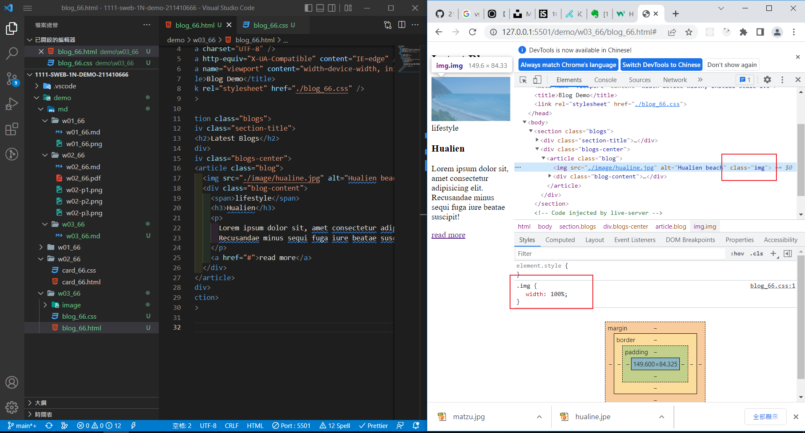
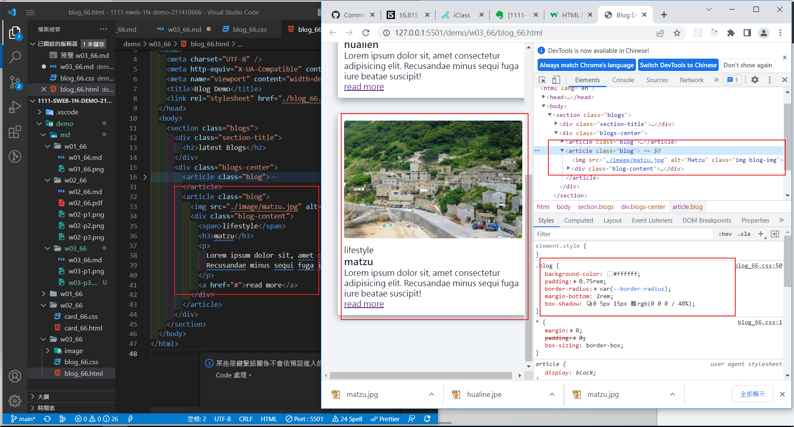
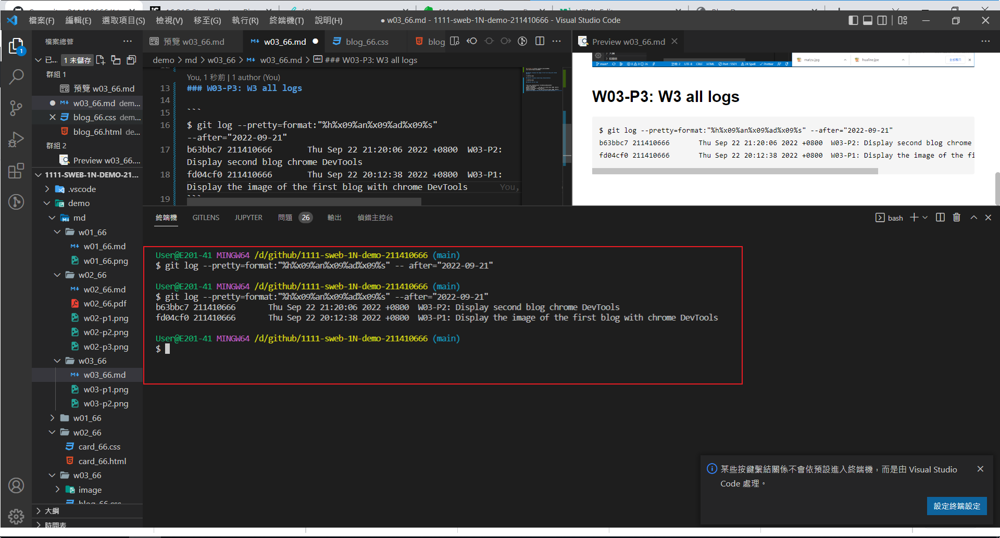

### Github repo url

[My Github url](https://github.com/211410666/1111-sweb-1N-demo-211410666)

### W03-P1: Display the image of the first blog with chrome DevTools



### W03-P2: Display second blog chrome DevTools



### W03-P3: W3 all logs



```
$ git log --pretty=format:"%h%x09%an%x09%ad%x09%s" --after="2022-09-21"
b63bbc7 211410666       Thu Sep 22 21:20:06 2022 +0800  W03-P2: Display second blog chrome DevTools
fd04cf0 211410666       Thu Sep 22 20:12:38 2022 +0800  W03-P1: Display the image of the first blog with chrome DevTools
```
