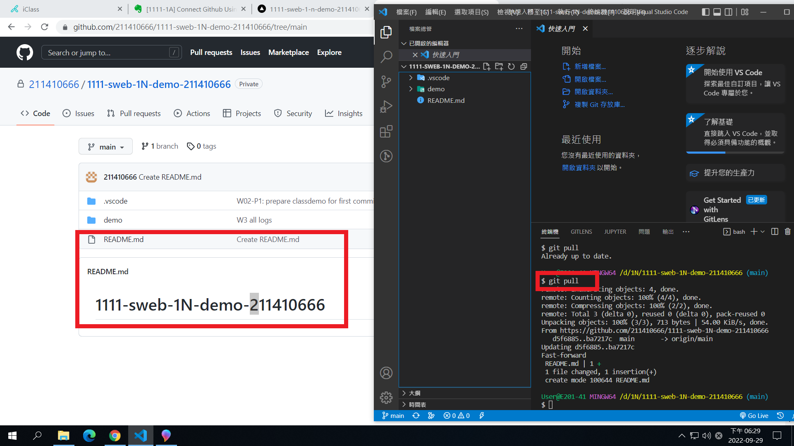
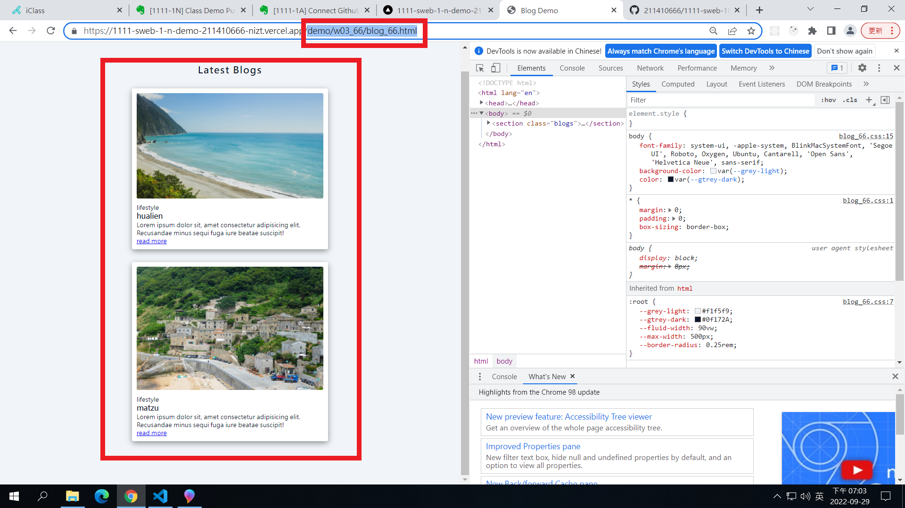
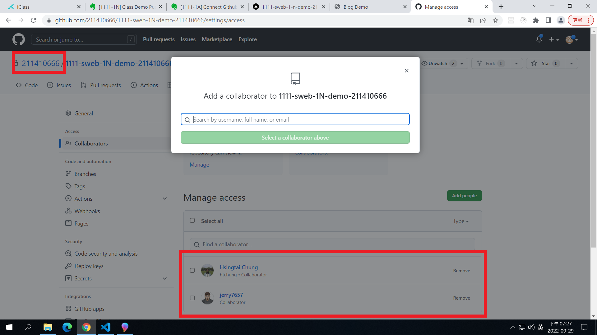
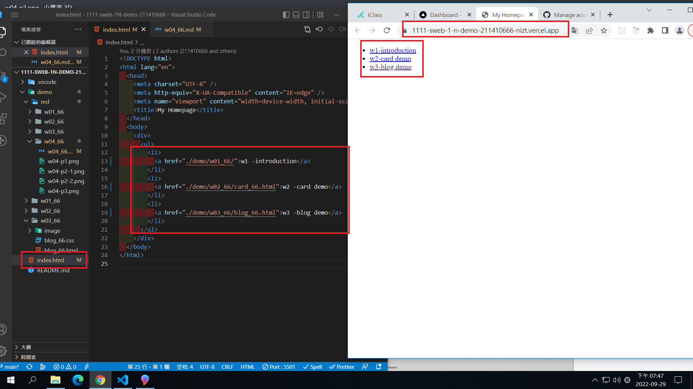
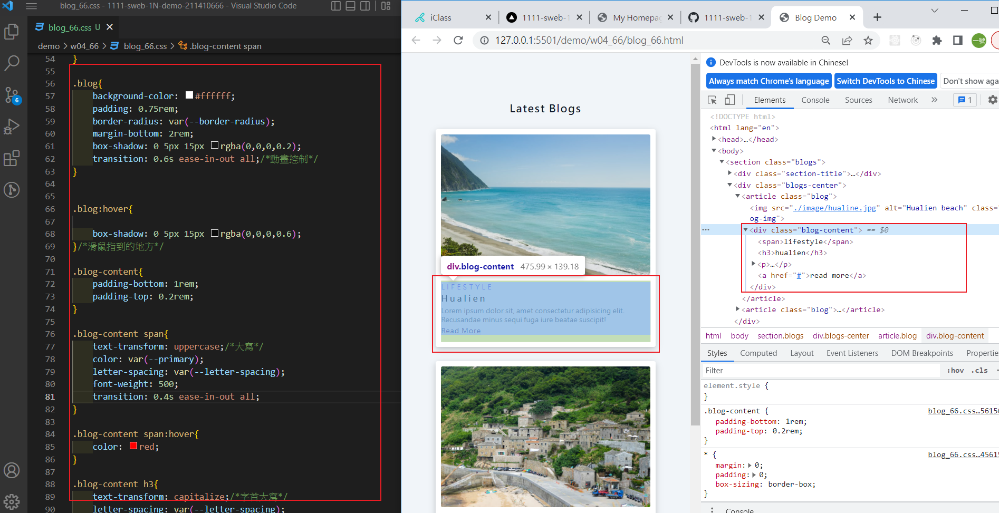
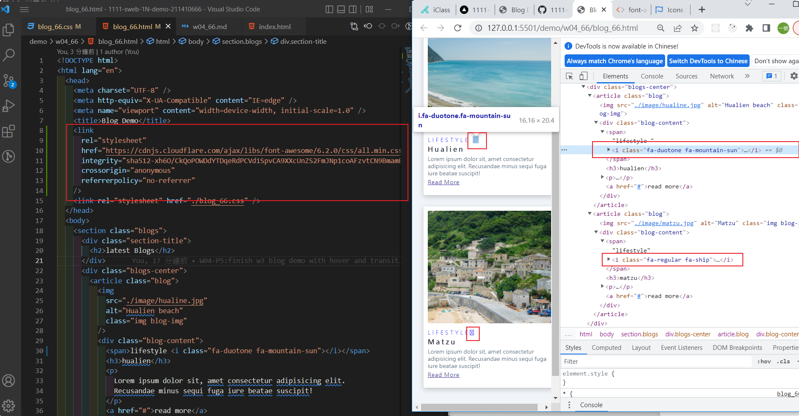
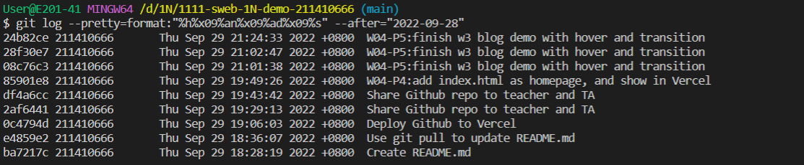

### Github repo url

[My Github url](https://github.com/211410666/1111-sweb-1N-demo-211410666)

### W03-P1: Use git pull to update README.md



### W04-P2:Deploy Github to Vercel




### W04-P3:Share Github repo to teacher and TA



### W04-P4:add index.html as homepage, and show in Vercel



### W04-P5:finish w3 blog demo with hover and transition



### W04-P6:Add font awesome css, add two icons



### W04-P7:W4 all logs



```
$ git log --pretty=format:"%h%x09%an%x09%ad%x09%s" --after="2022-09-28"
24b82ce 211410666       Thu Sep 29 21:24:33 2022 +0800  W04-P5:finish w3 blog demo with hover and transition
28f30e7 211410666       Thu Sep 29 21:02:47 2022 +0800  W04-P5:finish w3 blog demo with hover and transition
08c76c3 211410666       Thu Sep 29 21:01:38 2022 +0800  W04-P5:finish w3 blog demo with hover and transition
85901e8 211410666       Thu Sep 29 19:49:26 2022 +0800  W04-P4:add index.html as homepage, and show in Vercel
df4a6cc 211410666       Thu Sep 29 19:43:42 2022 +0800  Share Github repo to teacher and TA
2af6441 211410666       Thu Sep 29 19:29:13 2022 +0800  Share Github repo to teacher and TA
0c4794d 211410666       Thu Sep 29 19:06:03 2022 +0800  Deploy Github to Vercel
e4859e2 211410666       Thu Sep 29 18:36:07 2022 +0800  Use git pull to update README.md
ba7217c 211410666       Thu Sep 29 18:28:19 2022 +0800  Create README.md
```
