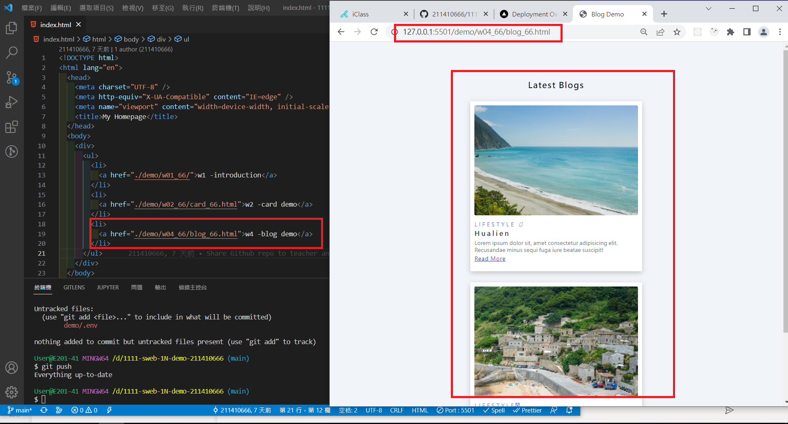
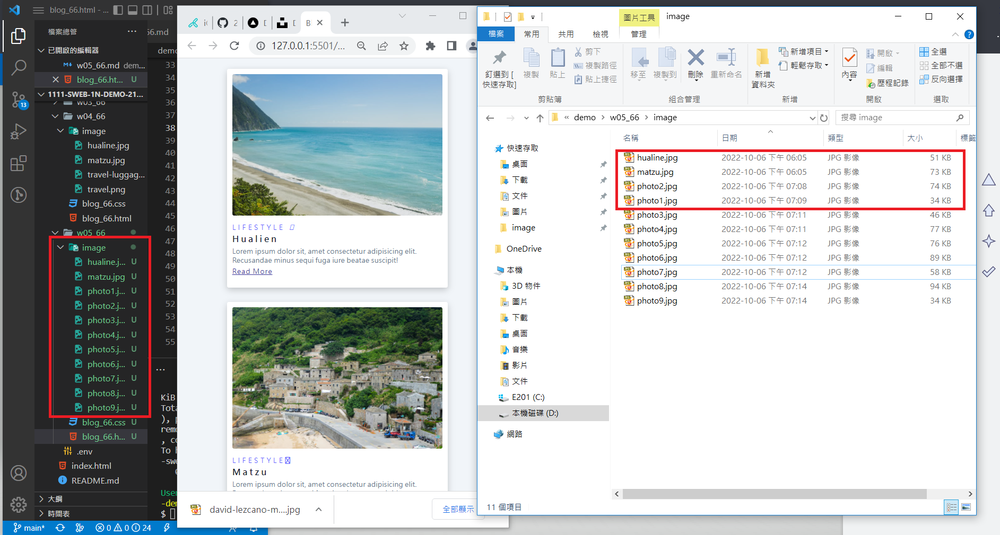
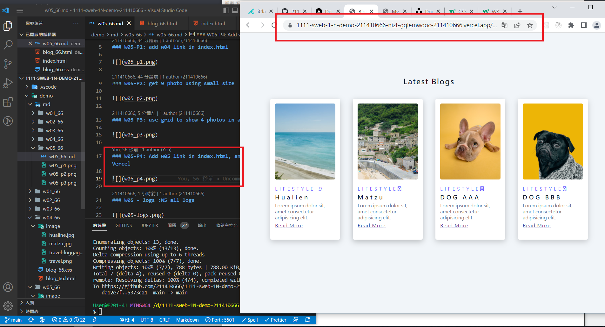
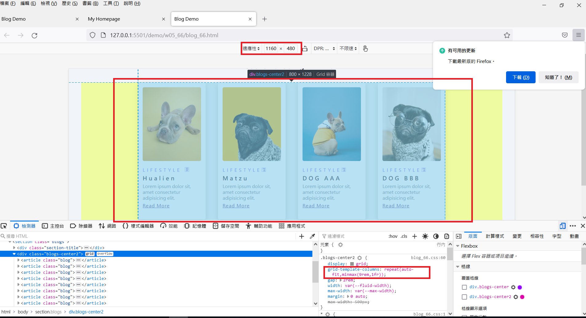
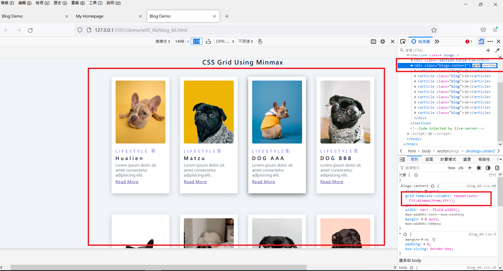
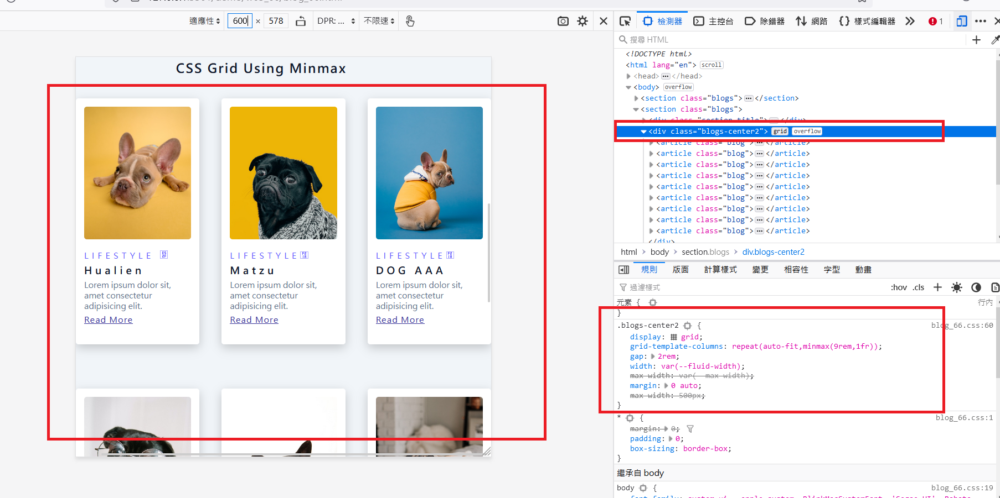
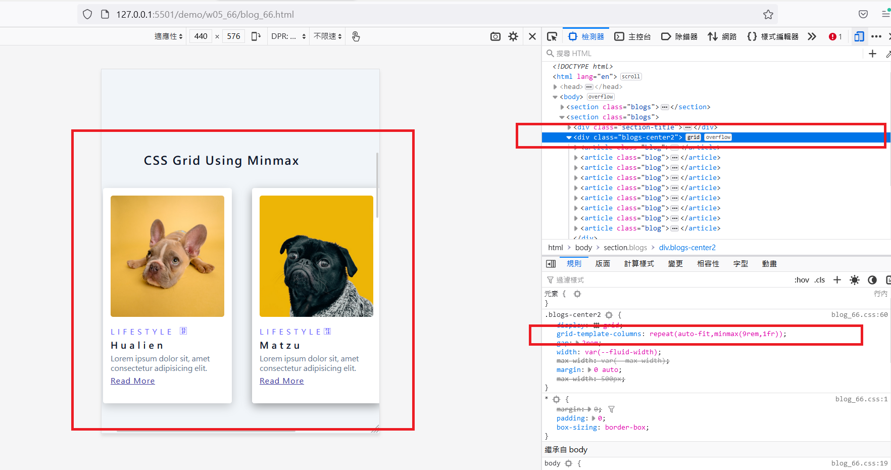
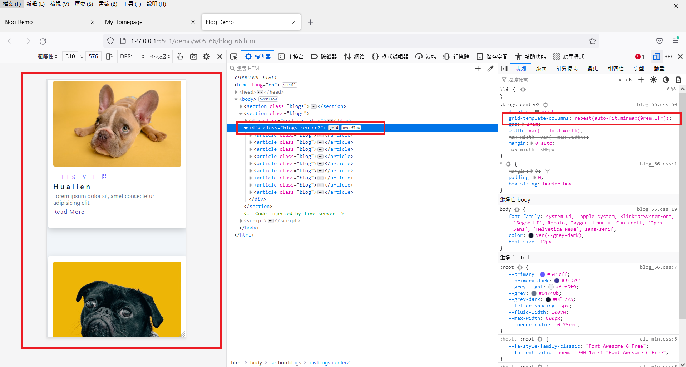
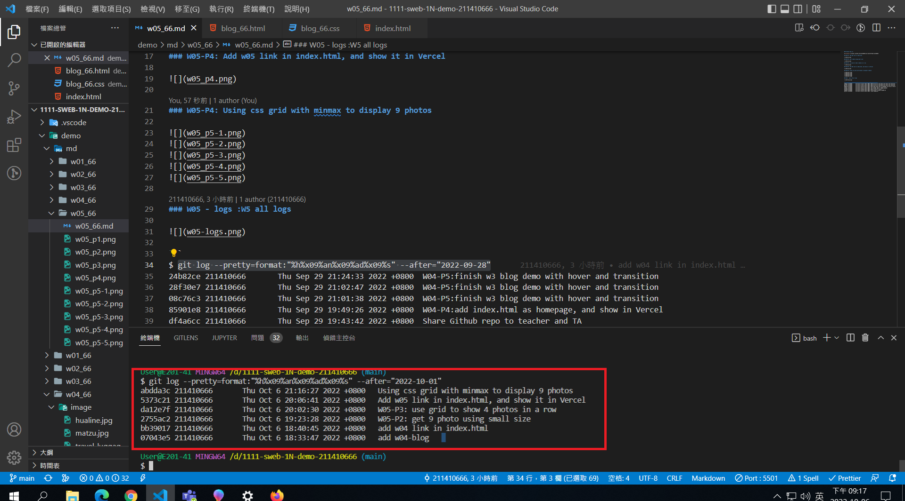

### Github repo url

[My Github url](https://github.com/211410666/1111-sweb-1N-demo-211410666)

### W05-P1: add w04 link in index.html



### W05-P2: get 9 photo using small size



### W05-P3: use grid to show 4 photos in a row


### W05-P4: Add w05 link in index.html, and show it in Vercel



### W05-P4: Using css grid with minmax to display 9 photos







### W05 - logs :W5 all logs



```
$ git log --pretty=format:"%h%x09%an%x09%ad%x09%s" --after="2022-10-01"
abdda3c 211410666       Thu Oct 6 21:16:27 2022 +0800   Using css grid with minmax to display 9 photos
5373c21 211410666       Thu Oct 6 20:06:41 2022 +0800   Add w05 link in index.html, and show it in Vercel
da12e7f 211410666       Thu Oct 6 20:02:30 2022 +0800   W05-P3: use grid to show 4 photos in a row
2755ac2 211410666       Thu Oct 6 19:23:28 2022 +0800   W05-P2: get 9 photo using small size
bb39017 211410666       Thu Oct 6 18:40:45 2022 +0800   add w04 link in index.html
07043e5 211410666       Thu Oct 6 18:33:47 2022 +0800   add w04-blog
```
