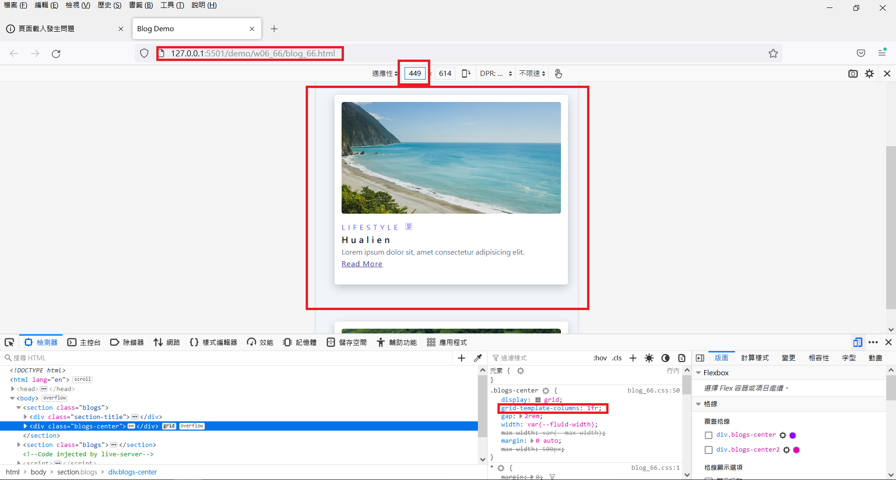
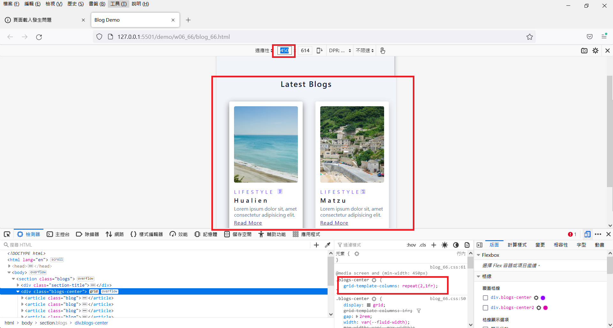
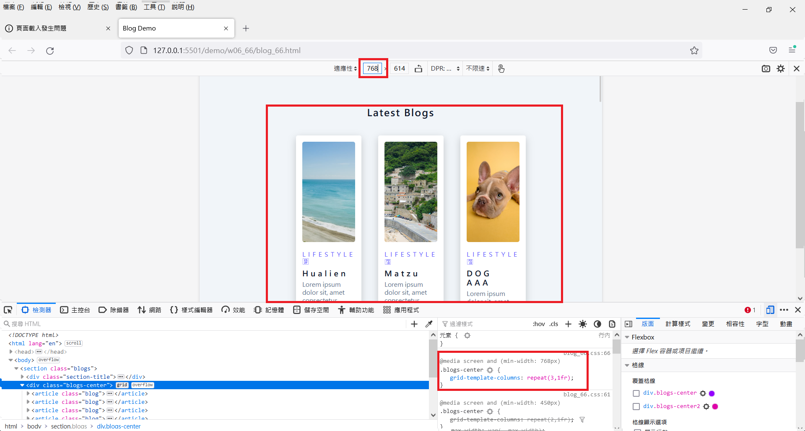
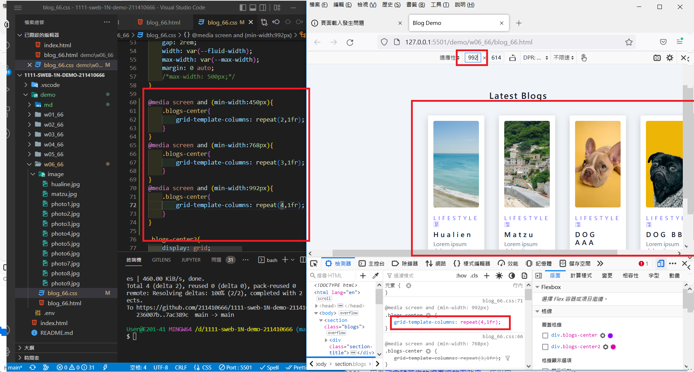
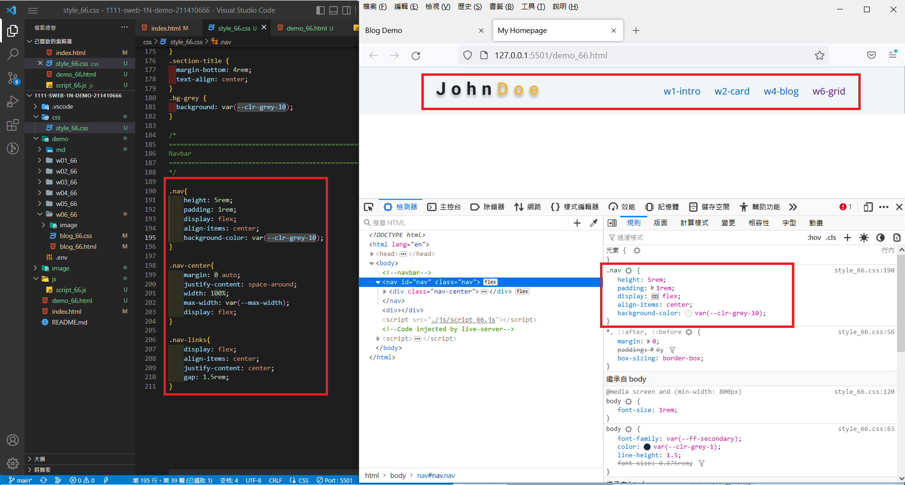
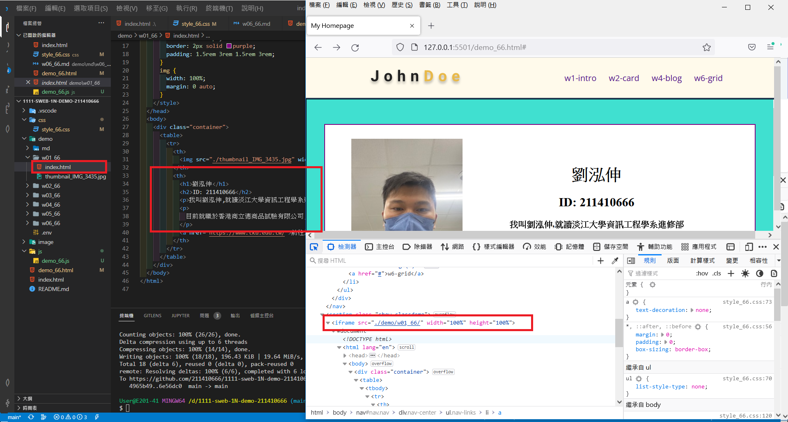
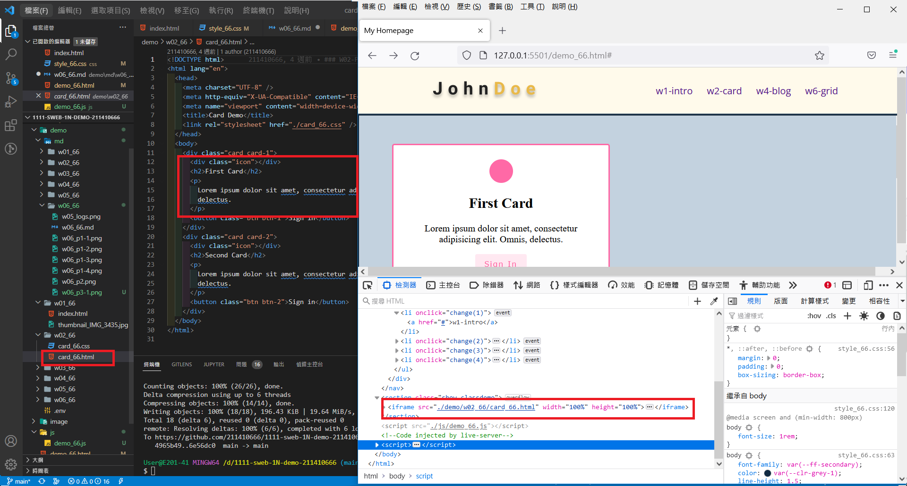
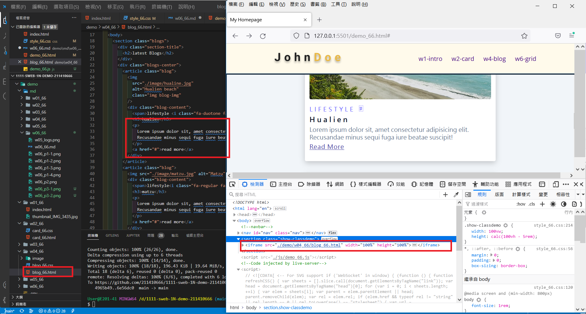
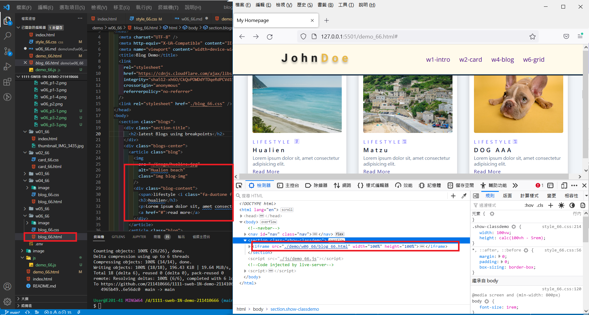
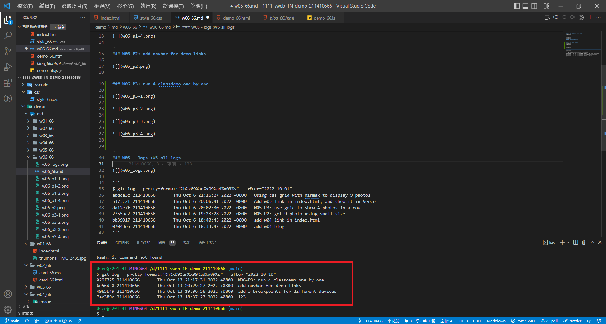

### Github repo url

[My Github url](https://github.com/211410666/1111-sweb-1N-demo-211410666)

### W06-P1: add 3 breakpoints for different devices









### W06-P2: add navbar for demo links



### W06-P3: run 4 classdemo one by one









### W05 - logs :W5 all logs



```
$ git log --pretty=format:"%h%x09%an%x09%ad%x09%s" --after="2022-10-10"
646e86d 211410666       Thu Oct 13 21:19:04 2022 +0800  W06-P3: run 4 classdemo one by one
029f325 211410666       Thu Oct 13 21:17:31 2022 +0800  W06-P3: run 4 classdemo one by one
6e56dc0 211410666       Thu Oct 13 20:29:27 2022 +0800  add navbar for demo links
4965b49 211410666       Thu Oct 13 19:06:56 2022 +0800  add 3 breakpoints for different devices
7ac389c 211410666       Thu Oct 13 18:37:27 2022 +0800  123
```
