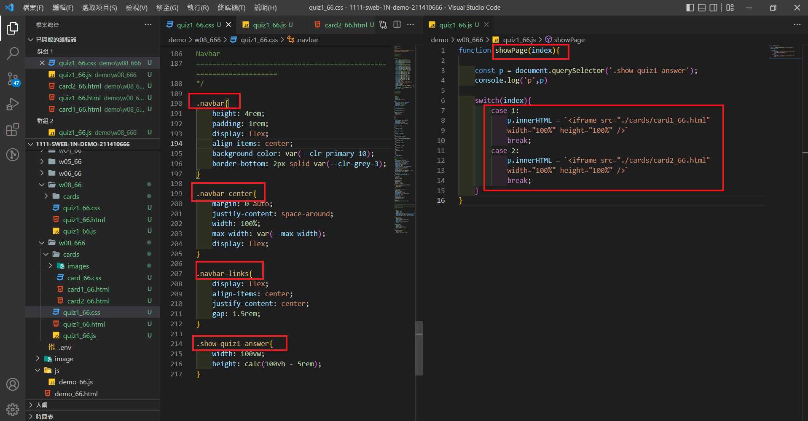
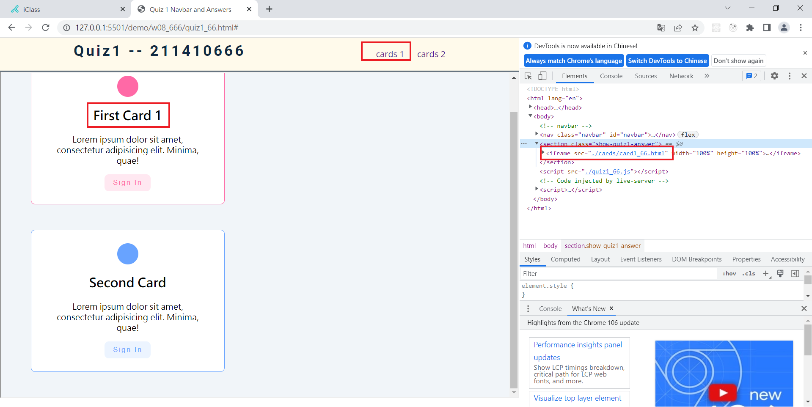
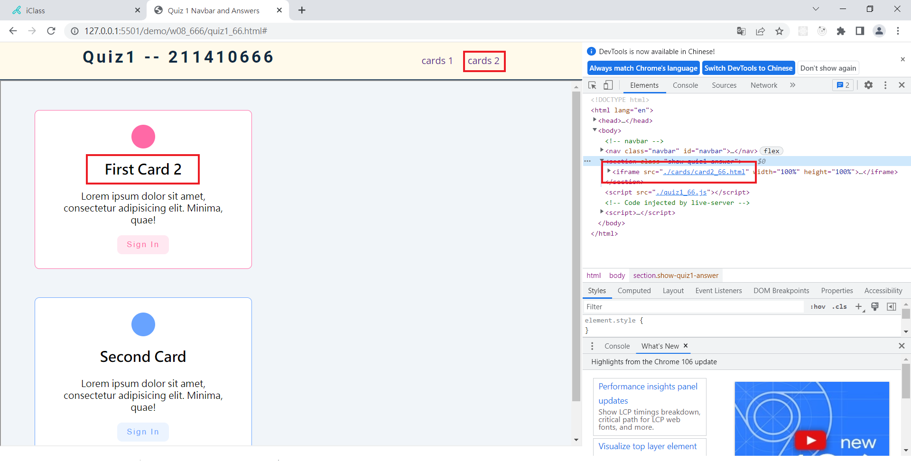
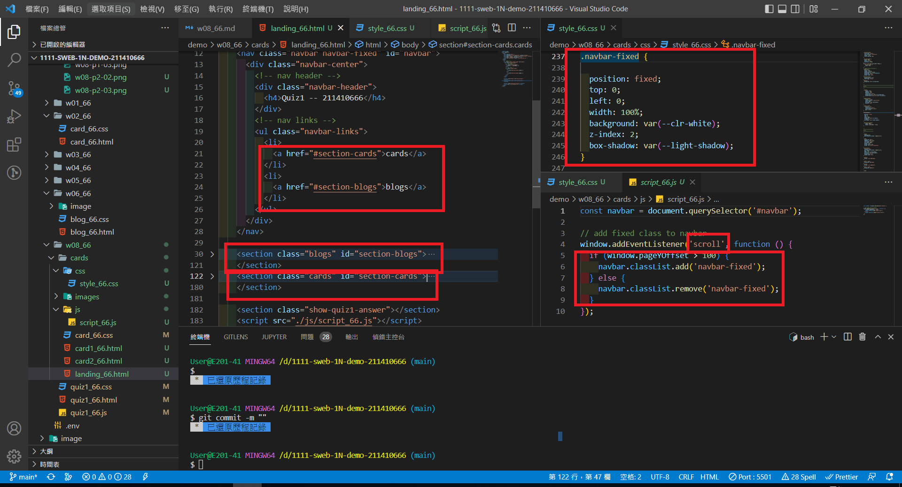
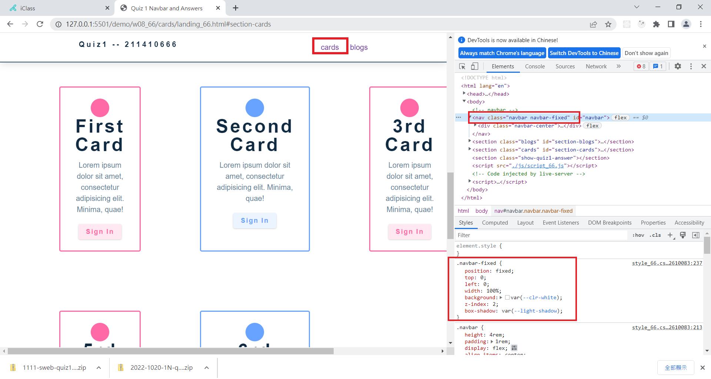
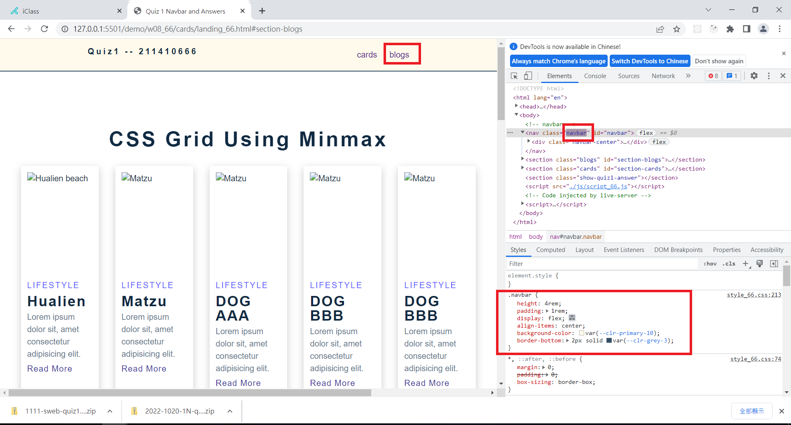
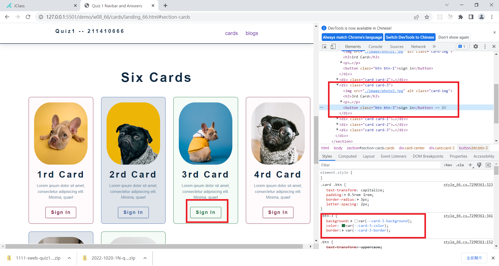
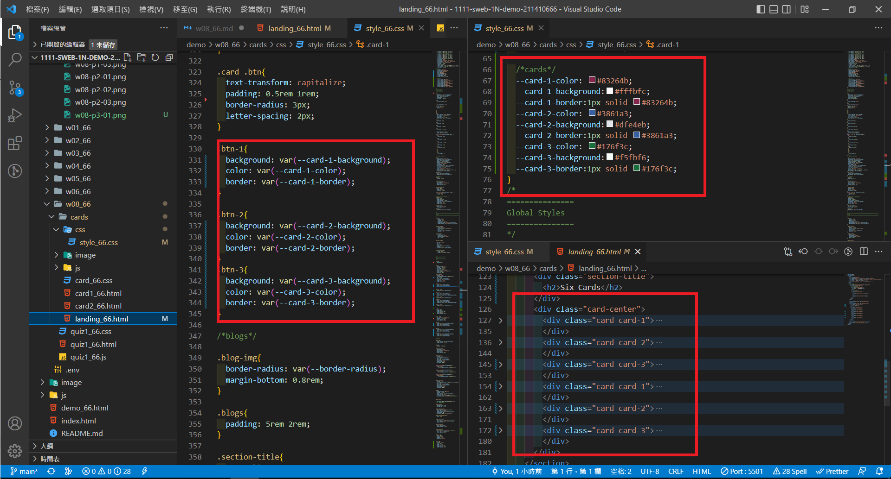
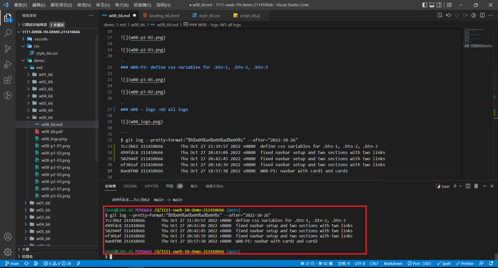

### Github repo url

[My Github url](https://github.com/211410666/1111-sweb-1N-demo-211410666)

### W08-P1: navbar with card1 and card2







### W08-P2: fixed navbar setup and two sections with two links







### W08-P3: define css variables for .btn-1, .btn-2, .btn-3





### W05 - logs :W5 all logs



```
$ git log --pretty=format:"%h%x09%an%x09%ad%x09%s" --after="2022-10-26"
ef301af 211410666       Thu Oct 27 20:18:39 2022 +0800  fixed navbar setup and two sections with two links
8ae8f00 211410666       Thu Oct 27 18:57:38 2022 +0800  W08-P1: navbar with card1 and card2

```
