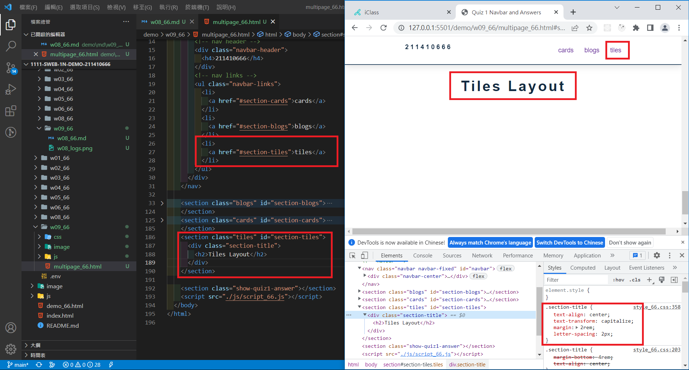
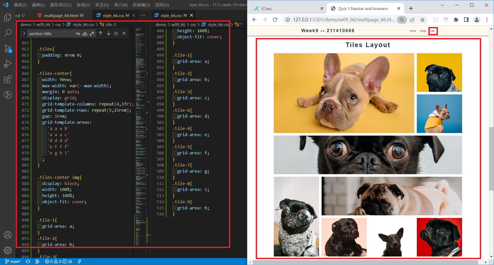
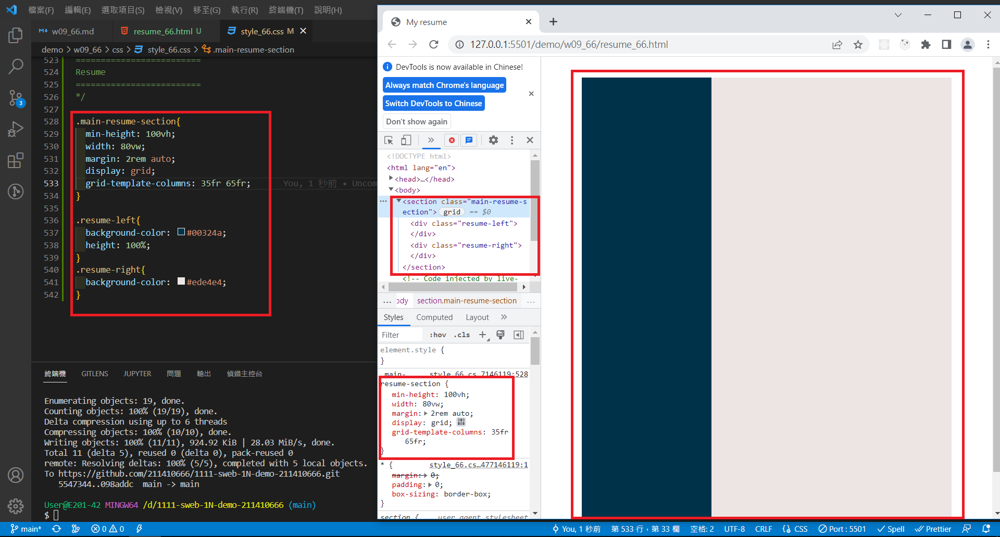
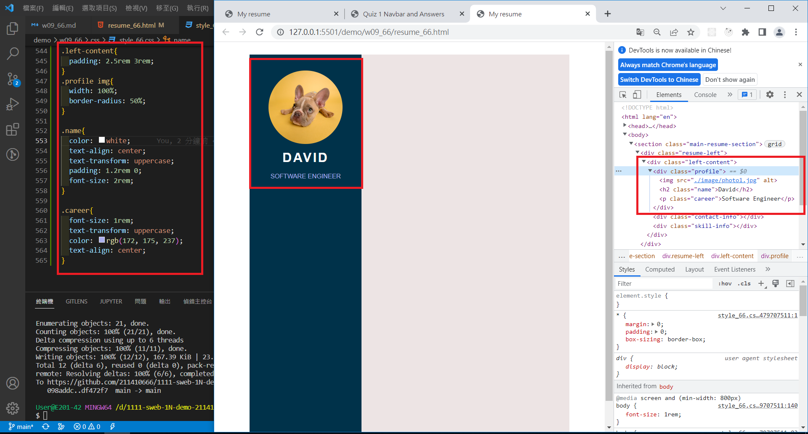
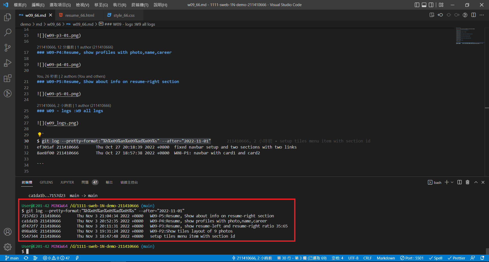

### Github repo url

[My Github url](https://github.com/211410666/1111-sweb-1N-demo-211410666)

### W09-P1:setup tiles menu item with section id



### W09-P2:Show tiles layout of 9 photos



### W09-P3:Resume, show resume-left and resume-right ratio 35:65



### W09-P4:Resume, show profiles with photo,name,career



### W09-P5:Resume, Show about info on resume-right section


### W09 - logs :W9 all logs



```
$ git log --pretty=format:"%h%x09%an%x09%ad%x09%s" --after="2022-11-01"
7157d23 211410666       Thu Nov 3 21:04:34 2022 +0800   W09-P5:Resume, Show about info on resume-right section
ca1da1b 211410666       Thu Nov 3 20:52:35 2022 +0800   W09-P4:Resume, show profiles with photo,name,career
df472f7 211410666       Thu Nov 3 20:11:31 2022 +0800   W09-P3:Resume, show resume-left and resume-right ratio 35:65
098addc 211410666       Thu Nov 3 19:31:24 2022 +0800   W09-P2:Show tiles layout of 9 photos
5547344 211410666       Thu Nov 3 18:47:48 2022 +0800   setup tiles menu item with section id

```
