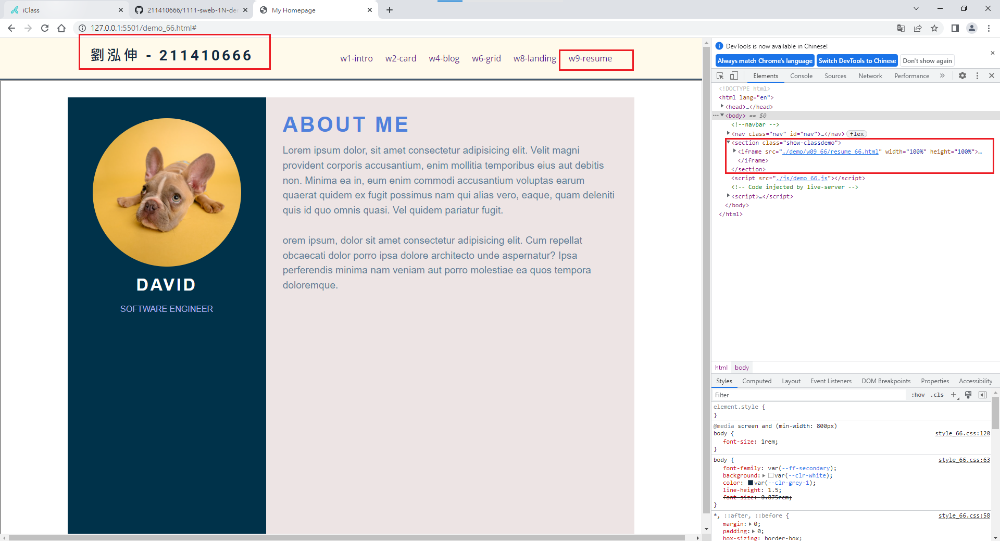
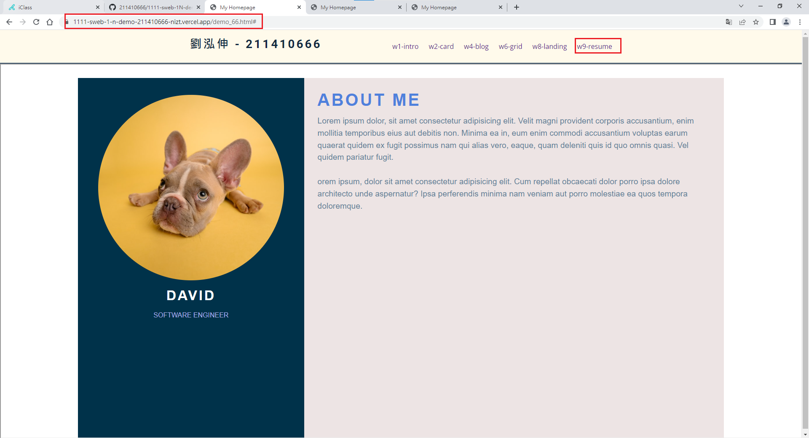
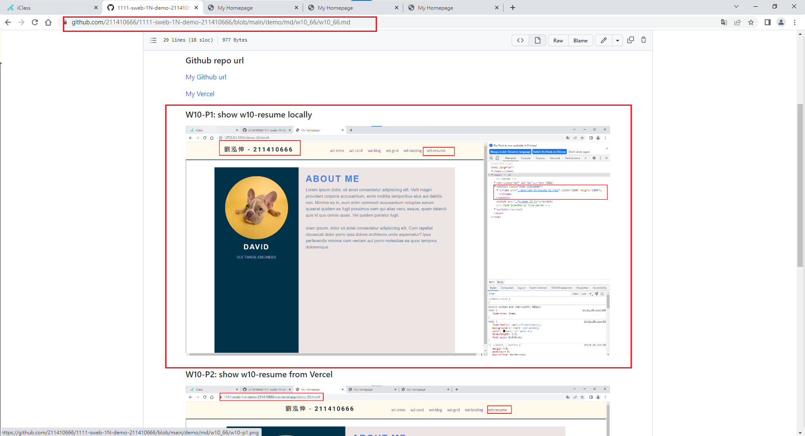

### Github repo url

[My Github url](https://github.com/211410666/1111-sweb-1N-demo-211410666)

[My Vercel](https://1111-sweb-1-n-demo-211410666-nizt.vercel.app/)

### W10-P1: show w10-resume locally



### W10-P2: show w10-resume from Vercel



### W10-P3: show w10_66.md from Github



### W10-logs: show all logs of Week 10


```
$ git log --pretty=format:"%h%x09%an%x09%ad%x09%s" --after="2022-11-09"
dd09313 211410666       Thu Nov 10 19:06:37 2022 +0800  W10-P3: show w10_66.md from Github
ac87949 211410666       Thu Nov 10 19:03:30 2022 +0800  show w10-resume from Vercel
5f8be62 211410666       Thu Nov 10 19:02:11 2022 +0800  show w10-resume locally

```
