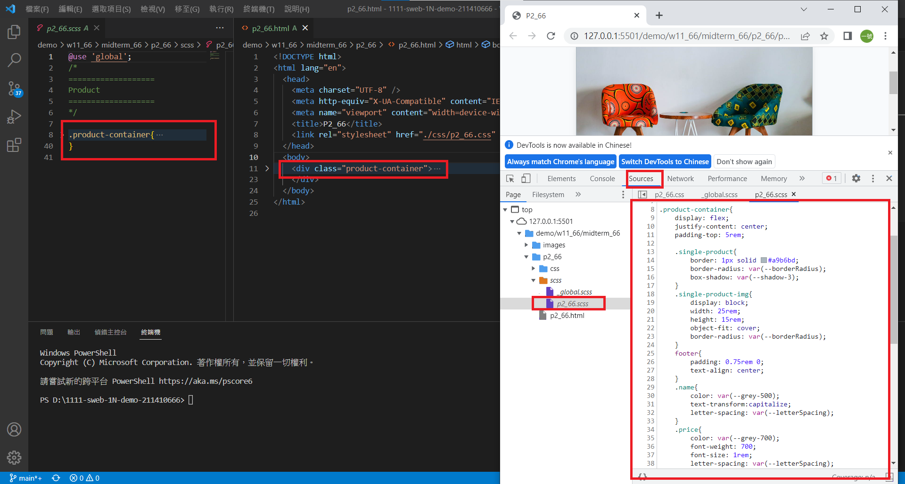
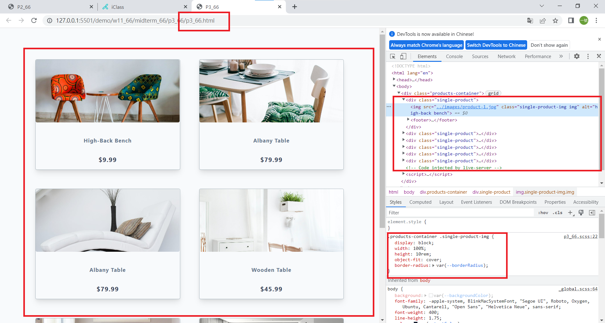
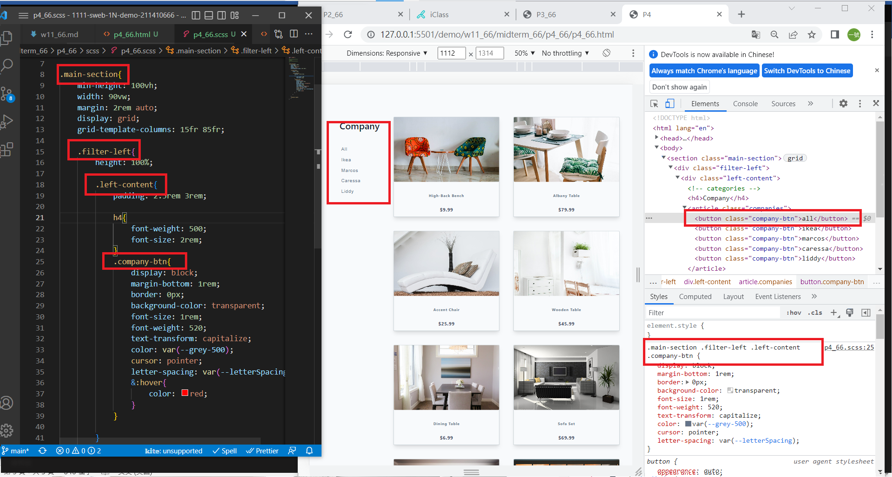
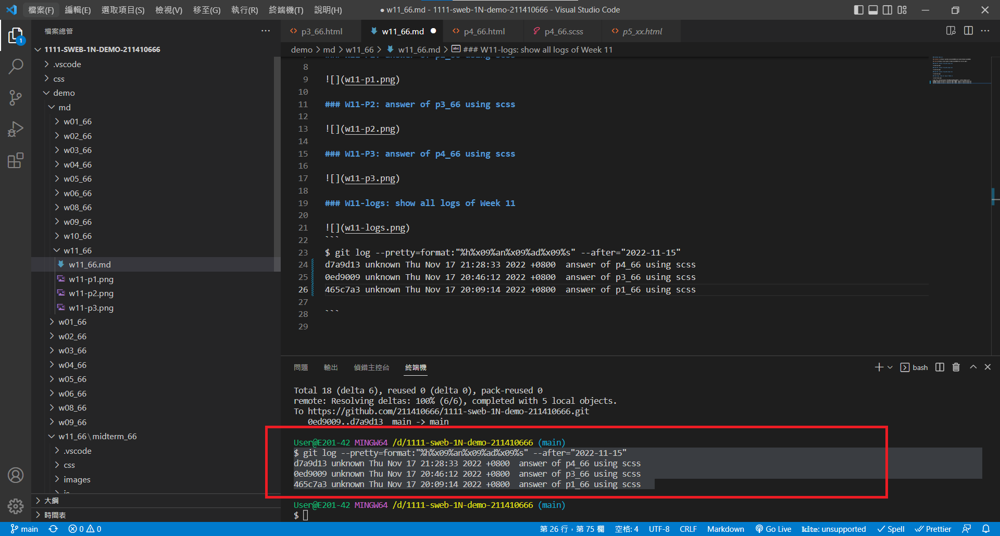

### Github repo url

[My Github url](https://github.com/211410666/1111-sweb-1N-demo-211410666)

[My Vercel](https://1111-sweb-1-n-demo-211410666-nizt.vercel.app/)

### W11-P1: answer of p2_66 using scss



### W11-P2: answer of p3_66 using scss



### W11-P3: answer of p4_66 using scss



### W11-logs: show all logs of Week 11


```
$ git log --pretty=format:"%h%x09%an%x09%ad%x09%s" --after="2022-11-15"
d7a9d13 unknown Thu Nov 17 21:28:33 2022 +0800  answer of p4_66 using scss
0ed9009 unknown Thu Nov 17 20:46:12 2022 +0800  answer of p3_66 using scss
465c7a3 unknown Thu Nov 17 20:09:14 2022 +0800  answer of p1_66 using scss

```
