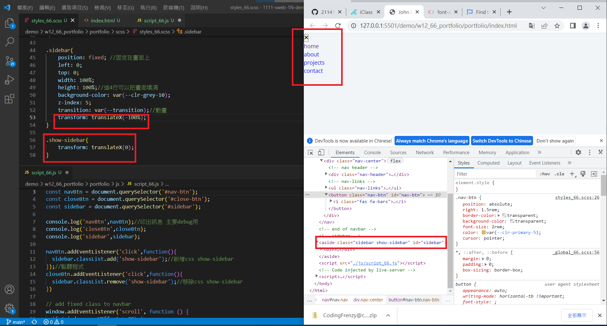
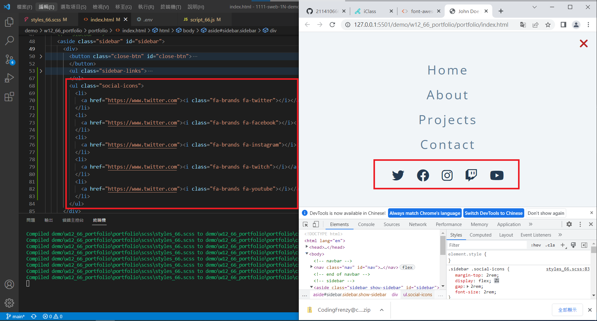
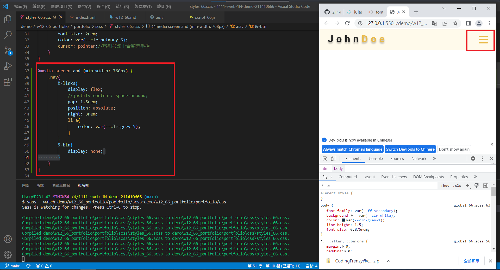
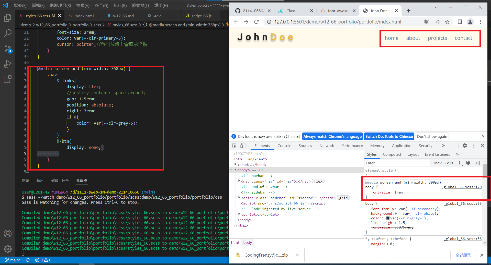
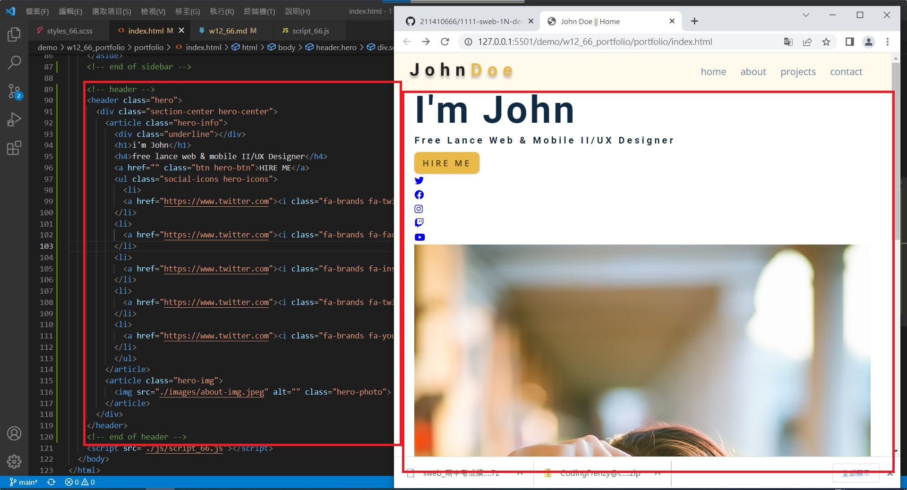
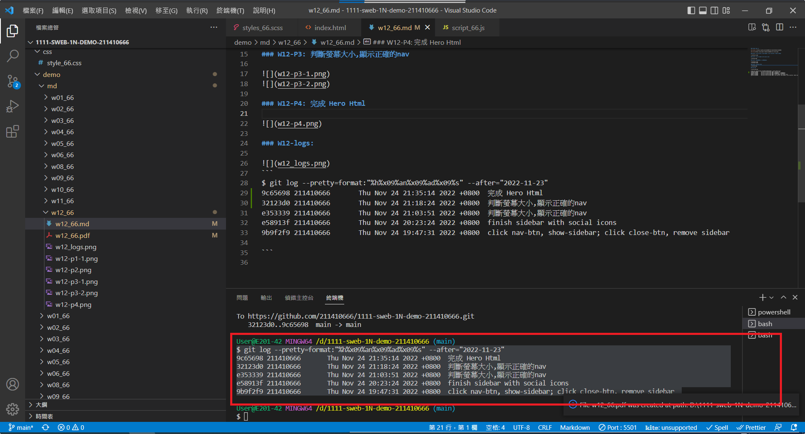

### Github repo url

[My Github url](https://github.com/211410666/1111-sweb-1N-demo-211410666)

[My Vercel](https://1111-sweb-1-n-demo-211410666-nizt.vercel.app/)

### W12-P1: click nav-btn, show-sidebar; click close-btn, remove sidebar



### W12-P2: finish sidebar with social icons



### W12-P3: 判斷螢幕大小,顯示正確的nav




### W12-P4: 完成 Hero Html



### W12-logs: 


```
$ git log --pretty=format:"%h%x09%an%x09%ad%x09%s" --after="2022-11-23"
9c65698 211410666       Thu Nov 24 21:35:14 2022 +0800  完成 Hero Html
32123d0 211410666       Thu Nov 24 21:18:24 2022 +0800  判斷螢幕大小,顯示正確的nav
e353339 211410666       Thu Nov 24 21:03:51 2022 +0800  判斷螢幕大小,顯示正確的nav
e58913f 211410666       Thu Nov 24 20:23:24 2022 +0800  finish sidebar with social icons
9b9f2f9 211410666       Thu Nov 24 19:47:31 2022 +0800  click nav-btn, show-sidebar; click close-btn, remove sidebar

```
