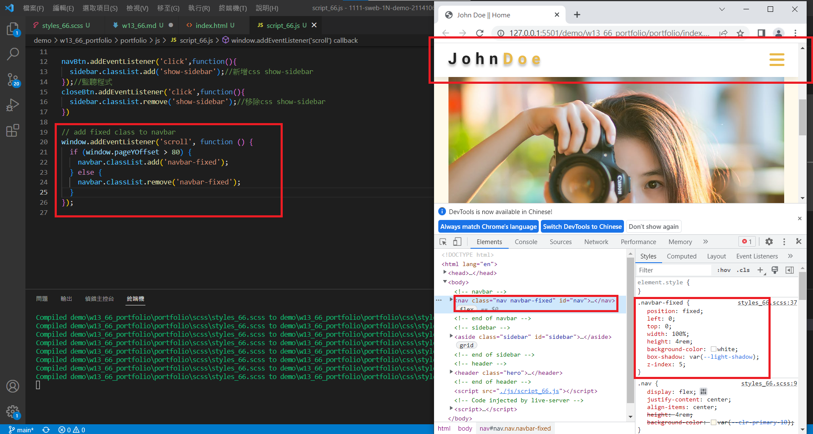
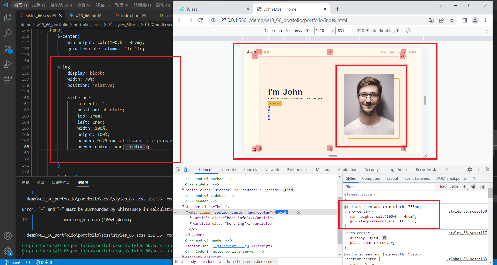
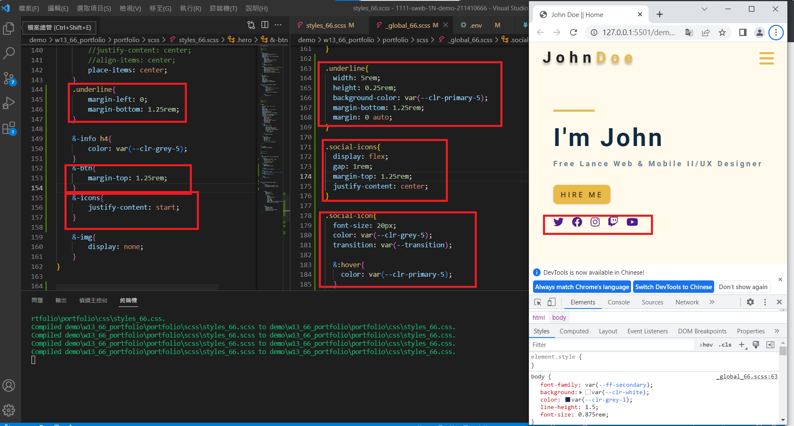
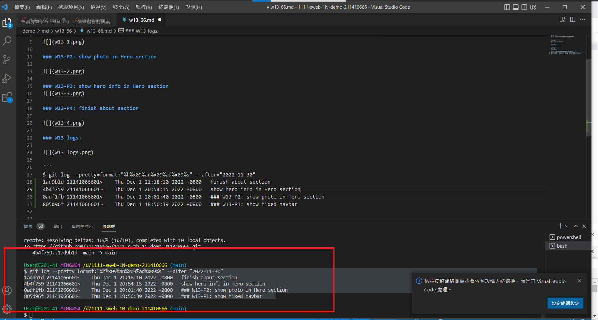

### Github repo url

[My Github url](https://github.com/211410666/1111-sweb-1N-demo-211410666)

[My Vercel](https://1111-sweb-1-n-demo-211410666-nizt.vercel.app/)

### W13-P1: show fixed navbar



### W13-P2: show photo in Hero section



### W13-P3: show hero info in Hero section


### W13-P4: finish about section


### W13-logs: 



```
$ git log --pretty=format:"%h%x09%an%x09%ad%x09%s" --after="2022-11-30"


```
