### Design a nav (include logo,link,icons)

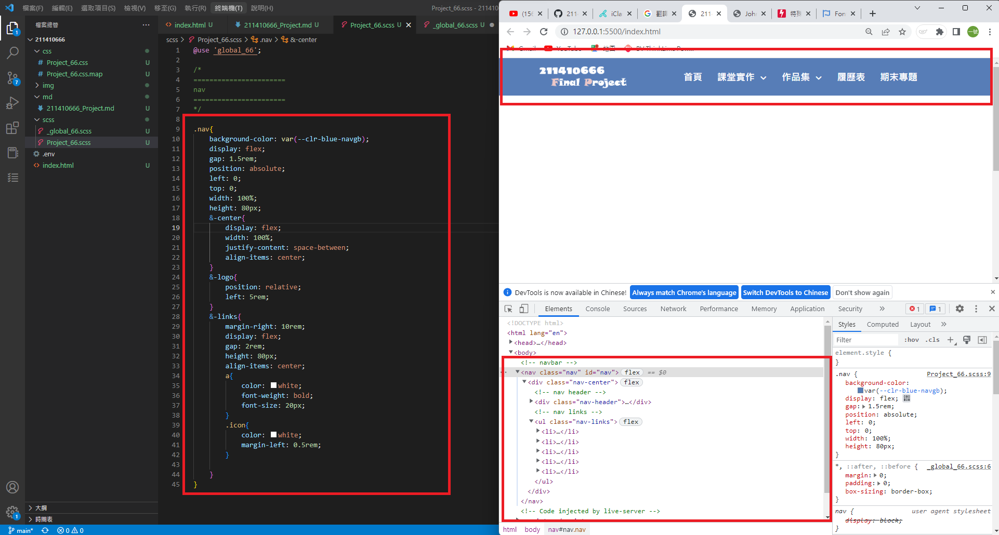

### Design the links transition and hover

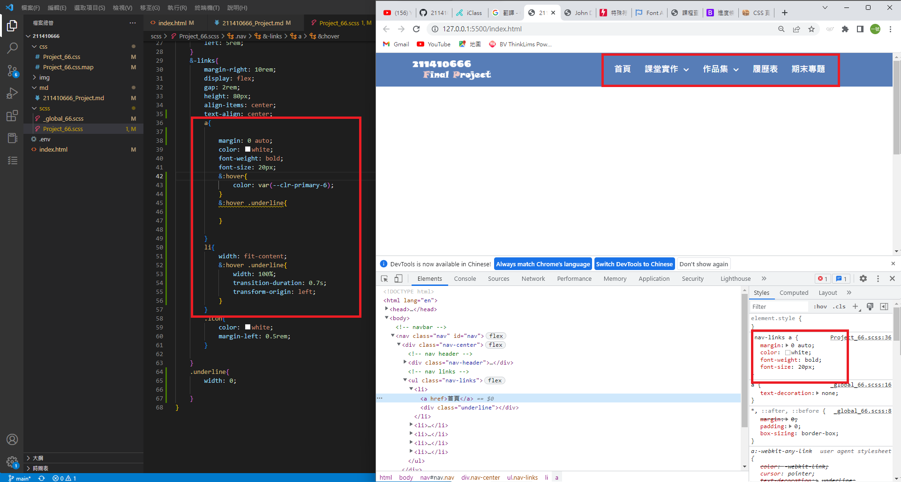
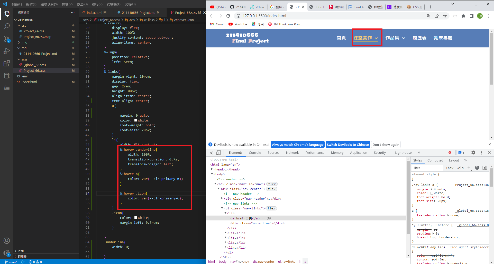

### Nav-fix by scroll pageY

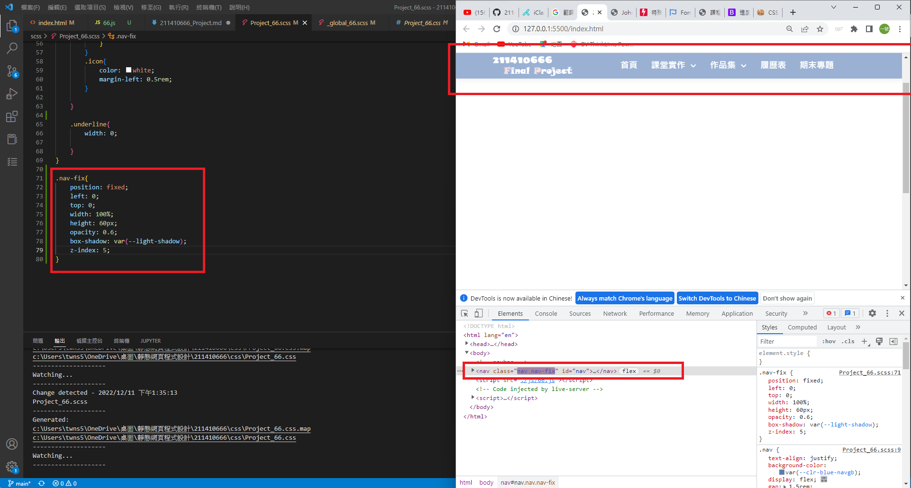

### Design a drop list for link demo and works (use transition and hover)

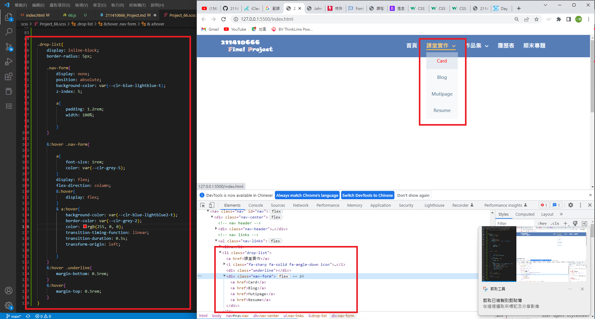

### breakpoint for nav

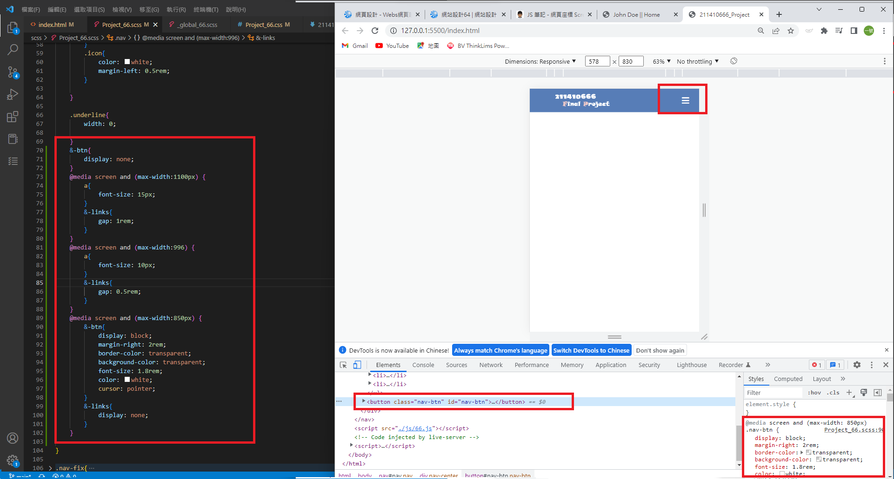
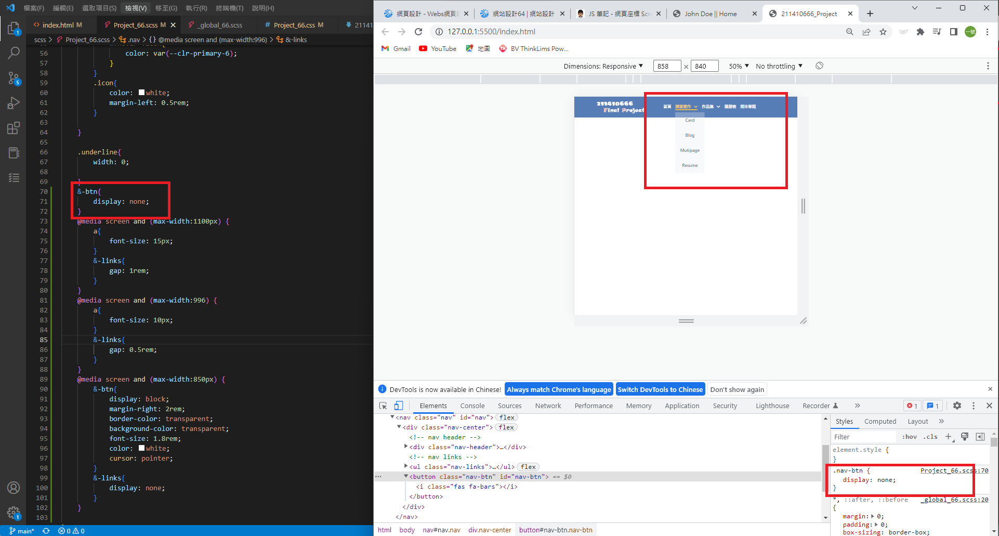

### Finish sidebar transition and fix the position on condition (max-width < 850)

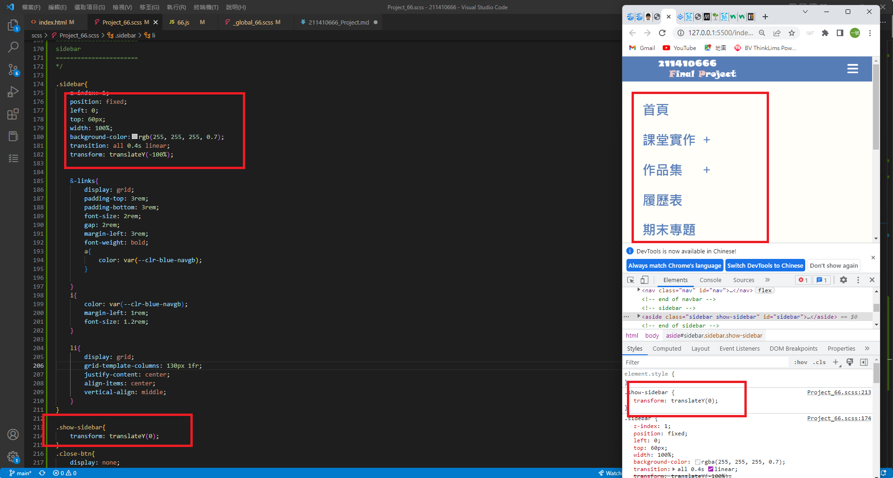

### link to personal ling ig and facebook with icons

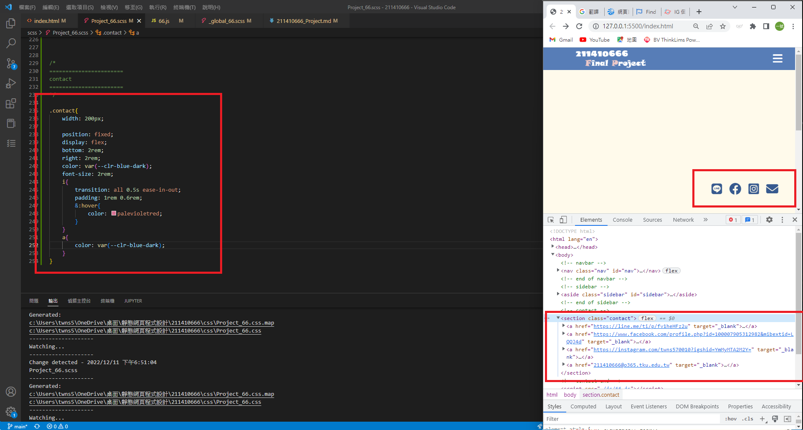

### design the button in portfolio

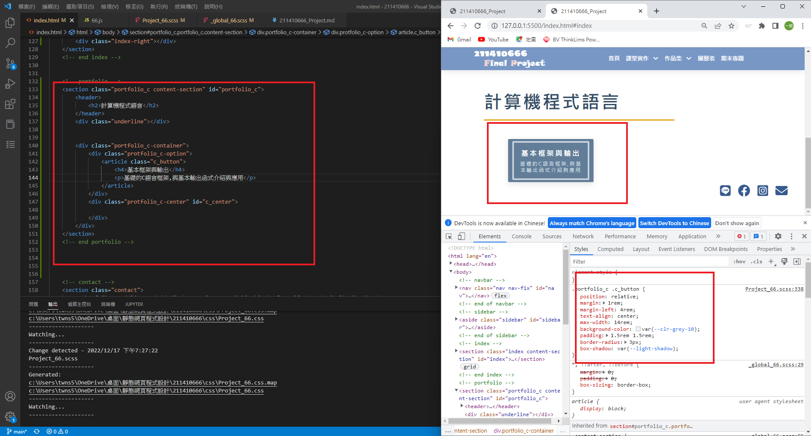

### design contect in portfolio and use iframe without border link to another one

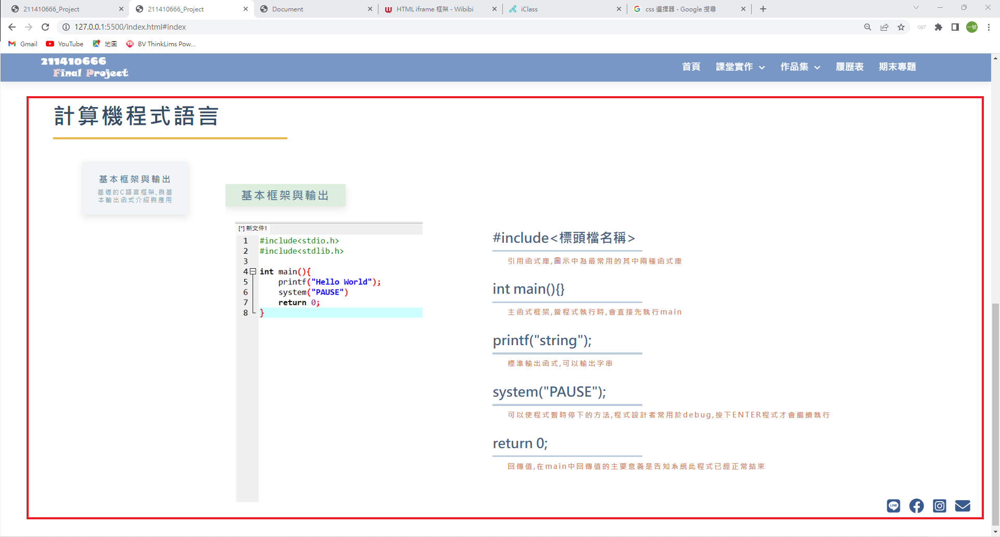
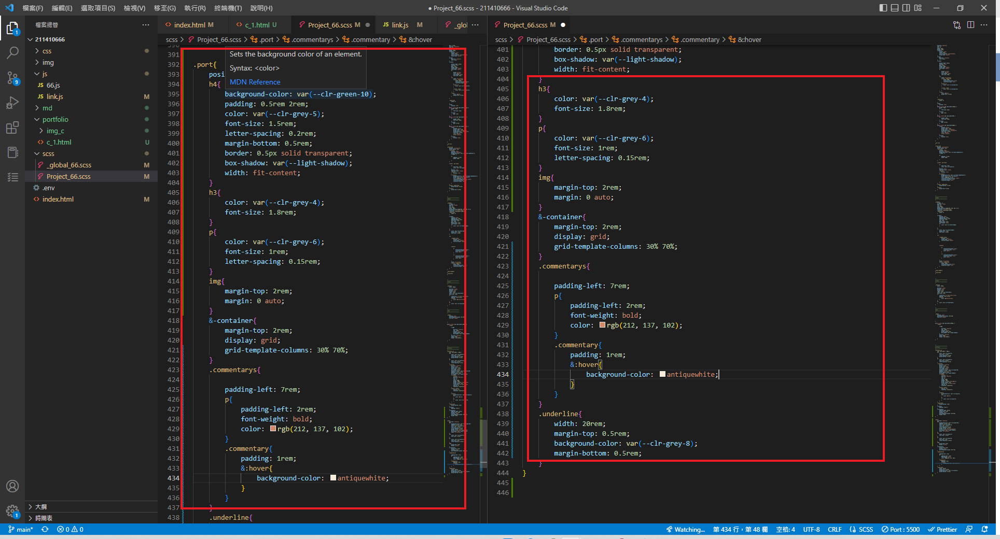
