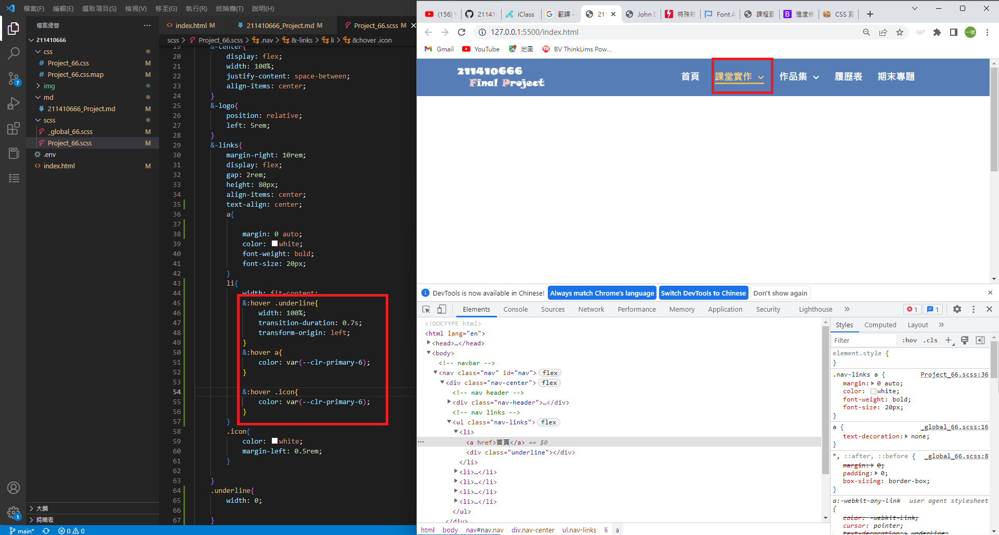
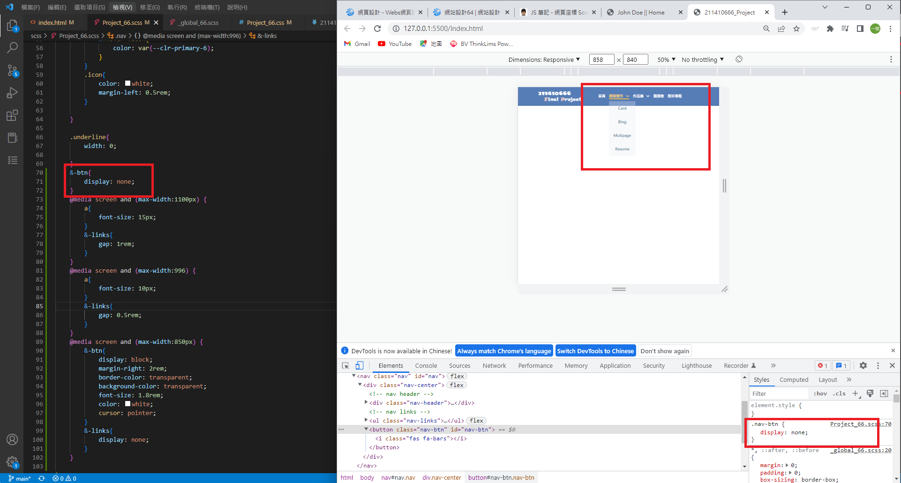
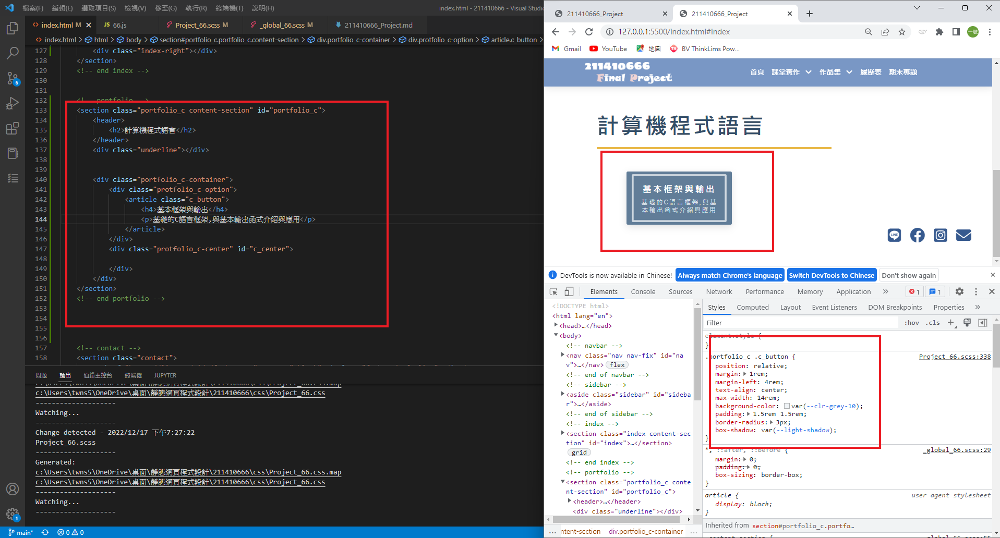
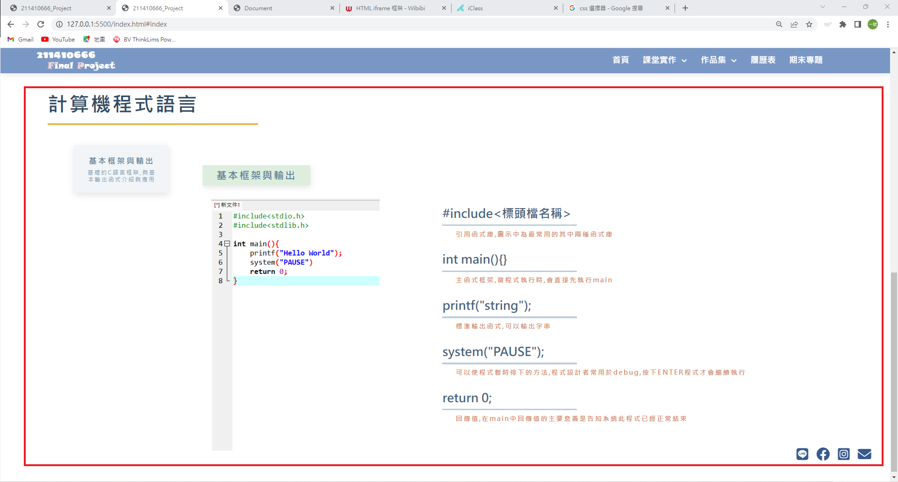
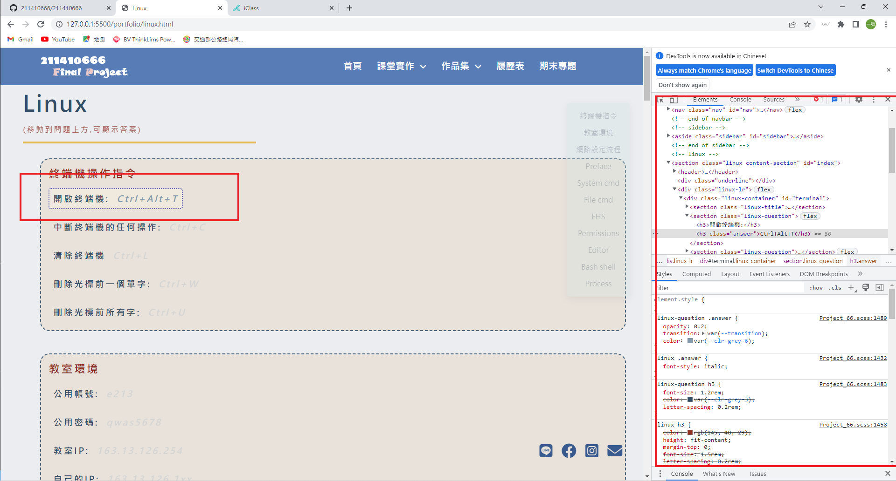

### Final Project Github repo url

[My Github url](https://github.com/211410666/211410666)

### Final Project Vercel url

[My Vercel url](https://211410666.vercel.app/)

### Design a nav (include logo,link,icons)

### Design the links transition and hover

### Nav-fix by scroll pageY

### Design a drop list for link demo and works (use transition and hover)

### breakpoint for nav

### Finish sidebar transition and fix the position on condition (max-width < 850)

### link to personal ling ig and facebook with icons

### design the button in portfolio

### design contect in portfolio and use iframe without border link to another one

### Complete C language content and typesetting

### Design Learn_66.html

### Design Resume with Skill and Information

### Design Resume add Timeline

### Design Introduction to Computers

### Design Linux and link all page Fisnish!!!!!!!

### log record

$ git log --pretty=format:"%h%x09%an%x09%ad%x09%s" --after="2022-12-20"
e3a7b3a 211410666 Wed Dec 28 22:38:29 2022 +0800 ### Design Linux and link all page Fisnish
640b73f 211410666 Wed Dec 28 17:24:56 2022 +0800 1228temp
5339ec3 211410666 Wed Dec 28 16:18:03 2022 +0800 1228temp
25a0441 211410666 Tue Dec 27 13:32:51 2022 +0800 1227temp
5cab15d 211410666 Tue Dec 27 11:28:58 2022 +0800 1227temp
99ab356 211410666 Mon Dec 26 23:55:21 2022 +0800 1226temp
edfe1e8 211410666 Mon Dec 26 19:29:12 2022 +0800 1226temp
b46ace7 211410666 Mon Dec 26 18:21:17 2022 +0800 1226temp
ebe5694 211410666 Mon Dec 26 16:38:43 2022 +0800 1226temp
dd44ed6 211410666 Mon Dec 26 15:52:08 2022 +0800 demo_66.md
f22554a 211410666 Mon Dec 26 15:47:16 2022 +0800 demo_66.md
aa8b83c 211410666 Mon Dec 26 15:29:38 2022 +0800 ### Design Introduction to Computers
c005913 211410666 Sun Dec 25 23:30:41 2022 +0800 ### Design Resume add Timeline
1c2d483 211410666 Sun Dec 25 18:55:40 2022 +0800 ### Design Resume with Skill and Information
1eb4a35 211410666 Thu Dec 22 23:20:43 2022 +0800 1222temp
fab88f9 211410666 Thu Dec 22 11:19:39 2022 +0800 1222temp
c150a6d 211410666 Wed Dec 21 23:51:23 2022 +0800 1221temp
c8a2599 211410666 Wed Dec 21 20:29:51 2022 +0800 ### Design Learn_66.html
af5569c 211410666 Wed Dec 21 00:39:17 2022 +0800 1221 temp
b456e02 211410666 Wed Dec 21 00:36:36 2022 +0800 1221 temp
$ git log --pretty=format:"%h%x09%an%x09%ad%x09%s" --after="2022-12-15" --before="2022-12-20"
6edd544 211410666 Tue Dec 20 16:30:00 2022 +0800 1220 temp
4b9cdf1 211410666 Tue Dec 20 00:20:23 2022 +0800 test
34c8976 211410666 Tue Dec 20 00:17:14 2022 +0800 test
0cd1005 211410666 Tue Dec 20 00:16:08 2022 +0800 test
62da027 211410666 Mon Dec 19 20:24:30 2022 +0800 ### Complete C language content and typesetting
4b3bce1 211410666 Sun Dec 18 22:00:55 2022 +0800 test
720655d 211410666 Sun Dec 18 20:24:12 2022 +0800 test
4a3bcfa 211410666 Sat Dec 17 22:51:34 2022 +0800 temp
39de9a2 211410666 Sat Dec 17 20:55:45 2022 +0800 ### design contect in portfolio and use iframe without border link to another one
f68dd3d 211410666 Sat Dec 17 19:34:14 2022 +0800 ### design the button in portfolio
$ git log --pretty=format:"%h%x09%an%x09%ad%x09%s" --after="2022-10-26" --before="2022-12-15"
dfcf4df 211410666 Mon Dec 12 22:56:16 2022 +0800 ### link to personal ling ig and facebook with icons
2c5ae28 211410666 Sun Dec 11 21:12:05 2022 +0800 ### link to personal ling ig and facebook with icons
fe2314c 211410666 Sun Dec 11 18:50:31 2022 +0800 ### Finish sidebar transition and fix the position on condition (max-width < 850)
9fcc9cf 211410666 Sun Dec 11 16:50:49 2022 +0800 ### breakpoint for nav
daebdf7 211410666 Sun Dec 11 15:29:05 2022 +0800 ### Design a drop list for link demo and works (use transition and hover)
4e8afb7 211410666 Sun Dec 11 06:29:41 2022 +0800 ### Design the links transition and hover
be63c49 211410666 Sat Dec 10 20:21:51 2022 +0800 ### Design a nav (include logo,link,icons)
f23c287 211410666 Sat Dec 10 19:09:15 2022 +0800 clear
340edf5 211410666 Wed Dec 7 23:37:51 2022 +0800 ### use button and backgroud-img to adjust opacity(hover) and js onclick to change h3 content
dea99ee 211410666 Wed Dec 7 23:32:22 2022 +0800 ### make logo to Portfolio & show Portfolio_img by tiles
f0f75db 211410666 Wed Dec 7 20:34:44 2022 +0800 1207
f0e26aa 211410666 Wed Dec 7 00:18:24 2022 +0800 ### link to all class demo
98ae9f4 211410666 Wed Dec 7 00:01:56 2022 +0800 ### link form and javascript add new css
bf07253 211410666 Wed Dec 7 00:01:28 2022 +0800 ### navbar and link css
9bda7fd 211410666 Tue Dec 6 23:43:54 2022 +0800 ### side navbar and links
